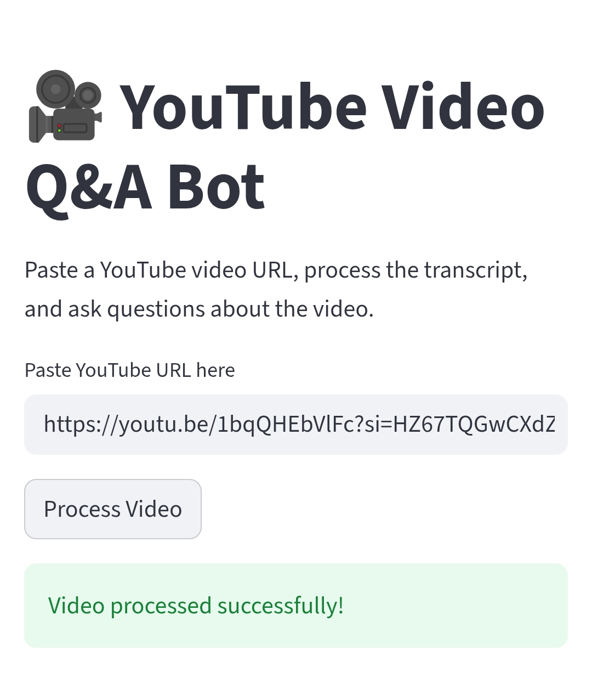
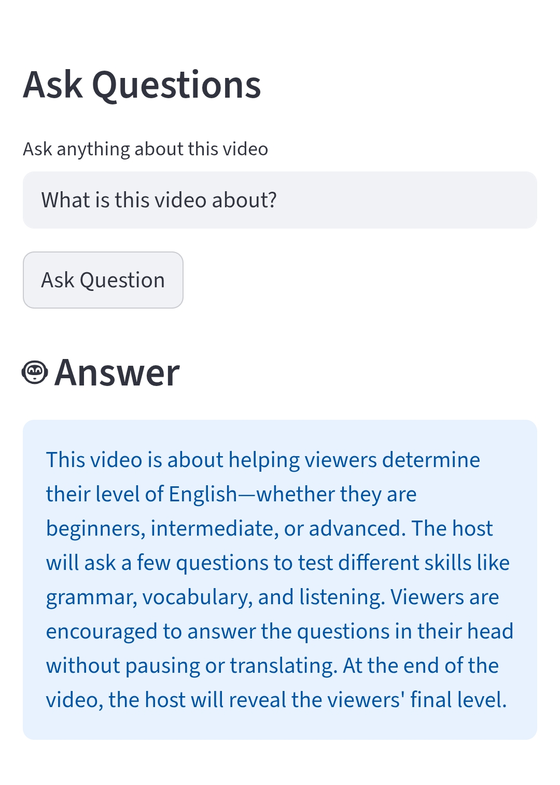

# 🎥 YouTube Video Q&A Bot

An AI-powered YouTube Question Answering application built using LangChain, OpenAI, FAISS, and Streamlit.

The app extracts transcripts from YouTube videos, converts them into vector embeddings, stores them in a FAISS vector database, and allows users to ask questions about the video content using Retrieval-Augmented Generation (RAG).

---
# 🌐 Live Demo
[Open App](https://youtube-app-bot.streamlit.app/)

# 🚀 Features

- Extract YouTube video transcripts
- Convert transcript into embeddings
- Store embeddings using FAISS vector database
- Ask questions about video content
- Context-aware AI answers
- Streamlit-based interactive UI
- Error handling for invalid or unavailable transcripts

---

# 🛠️ Tech Stack

- Python
- Streamlit
- LangChain
- OpenAI API
- FAISS
- youtube-transcript-api

---

# 📂 Project Structure

```bash
youtube-qa-bot/

├── app.py
│
├── utils/
│   ├── transcript.py
│   ├── embedder.py
│   └── qa_chain.py
│
├── requirements.txt
├── .env
└── README.md
```

---

# ⚙️ Installation

## Clone Repository

```bash
git clone <your-repo-link>
```

## Move into Project Folder

```bash
cd youtube-qa-bot
```

## Create Virtual Environment

```bash
python -m venv venv
```

## Activate Virtual Environment

### Windows

```bash
venv\Scripts\activate
```

## Install Dependencies

```bash
pip install -r requirements.txt
```

---

# 🔑 Setup Environment Variables

Create a `.env` file and add:

```env
OPENAI_API_KEY=your_openai_api_key
```

---

# ▶️ Run the Application

```bash
python -m streamlit run app.py
```

---

# 🧠 How It Works

1. User pastes YouTube URL
2. Transcript is extracted
3. Transcript is split into chunks
4. OpenAI embeddings are generated
5. FAISS vector database is created
6. Relevant transcript chunks are retrieved
7. GPT generates grounded answers from transcript context

---

# 📸 Screenshots

## Homepage



---

## Answer Generation



---

# 📌 Future Improvements

- Chat history
- Source citations
- Video thumbnail preview
- Multi-video support
- PDF export

---

# 👩‍💻 Author

Mansi Singh
